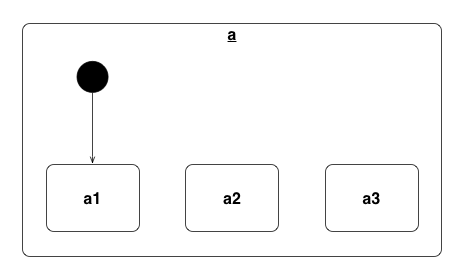
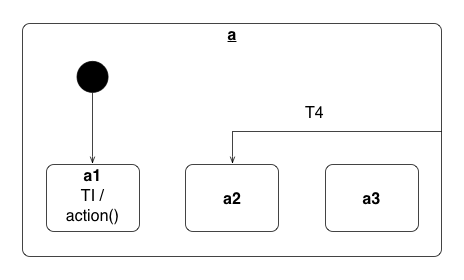
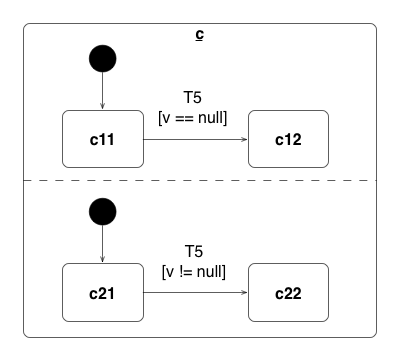

# HSM for Unity3d/C#

## General

A hierarchical statemachine for Unity implemented in C#


## Installation

To install this library add `hsm` to your bower file and run `bower install`.

## States and State Machines

States are specific by creating Hsm.State instances. They are then composed to a state machine by passing them to the Hsm.StateMachine constructor.



```cs
using Hsm;

State a1 = new State("a1");
State a2 = new State("a2");
State a3 = new State("a3");

StateMachine a = new StateMachine(a1, a2, a3);
```

Alternatively the state machine can also be constructed in several other way. For more details see the [Instantiate*-tests](lib/hsm/Editor/tests/testStateMachine.cs):

```cs
using Hsm;

// one big constuctor
StateMachine a = new StateMachine(
    new State("a1"),
    new State("a2"),
    new State("a3")
);

// or attaching the states after state machine construction
StateMachine a = new StateMachine();
a.AddState(new State("a1"));
a.AddState(new State("a2"));
a.AddState(new State("a3"));

// or by using *chaining*, which in C# terminology is often called *Fluent Interface*
StateMachine a = new StateMachine()
.AddState(new State("a1"))
.AddState(new State("a2"))
.AddState(new State("a3"));
```

By Convention, the first state passed is the initial state. The state machine is then initialized by

```cs
a.setup();
```

This starts the state machine and activates the initial state, calling its enter handler (see below). The state machine is now ready to handle events.

## Entry and Exit handlers

Each state can have an `exitAction` and an `enterAction`. They will be invoked when a state is entered or exited.

Example of specifying enter/exit actions (using chaining):

```cs
using Hsm;

State a = new State("a")
.OnExit((data) => {
    // your code here
})
.OnEnter((data) => {
    // your code here
});
```

## Actions and State Transitions

Each state has a map of event handlers. These handlers will be called when the state receives the respective event. Event handlers are added to the handlers list of each state (based on previous example state machine `a`):


```cs
a3.AddHandler("T3", a2);
a3.AddHandler("T3", a2, data => {
    // ...
});
```

## External, Internal and Local Transitions

External, internal and local transitions can be selected by using the `Transition` enum:

```cs
a.AddHandler("T4", a2, Transition.Local);
a3.AddHandler("TI", a1, Transition.Internal, data => {
    // ...
});
```



External transitions are used by default. When using internal transitions target state must be the similar to the handling state:

```cs
a3.AddHandler("T3", a2); // external by default
a3.AddHandler("T3", a2, Transition.External);
```

## Guard Conditions

Transition can be guarded by a specified condition:

```cs
c11.AddHandler("T5", c12, data => {
    return (data["v"] == null);
});
c21.AddHandler("T5", c22, data => {
    return (data["v"] != null);
});
```



## Sub-StateMachines (nested)

StateMachines can be nested in other state machines by using the `Hsm.Sub` adapter class.

All events are propagated into the sub-state machines, and the sub state machine is initialed and torn down on enter/exit of its containing state.


```cs
using Hsm;

Sub a = new Sub("a", new StateMachine(
    new State(a1),
    new State(a2),
    new State(a3)
));
```

For more details on how to construct a Hsm.Sub consult the [tests](lib/hsm/Editor/tests/testSubmachine.cs).

## Parallel State-Machines (orthogonal regions)

Parallel state machines are constructed with the Hsm.Parallel adapter class.

All events are propagated to all contained orthogonal state machines contained in the Hsm.Parallel. An events is treated as handled as soon as one of those state machines handles an event (returns `true`).


```cs
using Hsm;

Parallel c = new Parallel("c",
    new StateMachine(
        new State("c11"),
        new State("c12")
    ),
    new StateMachine(
        new State("c21"),
        new State("c22")
    )
);
```

For more details on how to construct a Hsm.Parallel consult the [tests](lib/hsm/Editor/tests/testParallel.cs).

## Development Setup

Install dependencies:

```sh
cd example_project
bower install
```

To run the test suite:

```sh
$Unity_APP -runTests -projectPath `pwd` -testResults ../output/editormodeTests.xml -testPlatform editmode -batchmode -logFile
```
