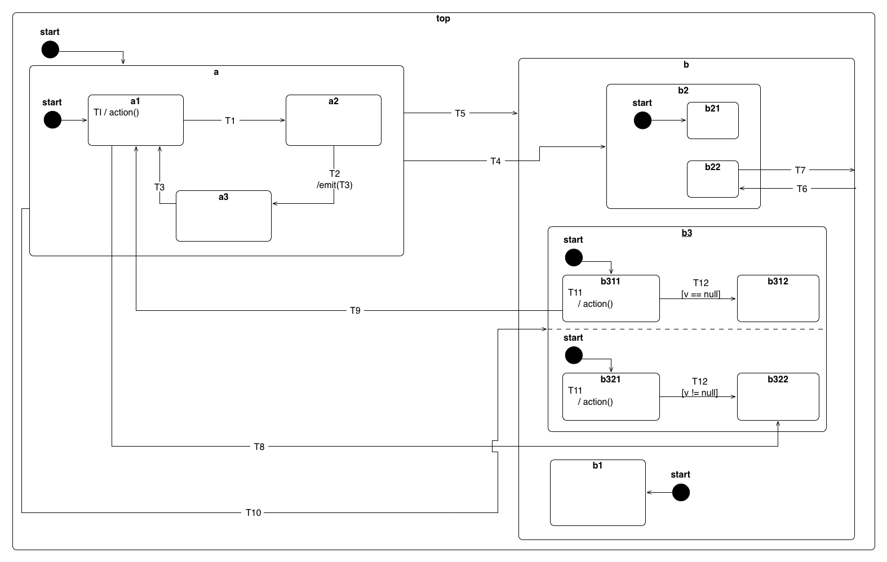
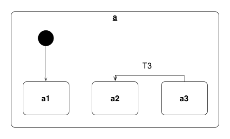
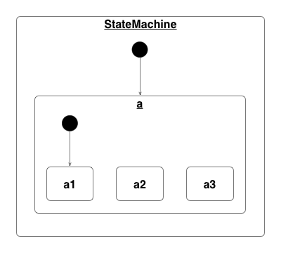
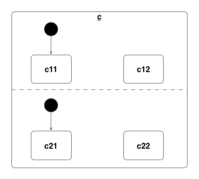

# HSM for Unity

## General

A hierarchical statemachine for Unity implemented in C#



## Installation

To install this library add `hsm` to your `bower.json` file and run `bower install`.

## States and State Machines

### Setup


Import the hsm:

```cs
using hsm;
```

States are specific by creating `Hsm.State` instances. They are then passed to the `Hsm.StateMachine` constructor. By convention, the first state passed is the initial state:

```cs
State a1 = new State("a1");
State a2 = new State("a2");
State a3 = new State("a3");

StateMachine a = new StateMachine(a1, a2, a3);
```

Alternatively the state machine can also be constructed by passing `State` instances as arguments:

```cs
StateMachine sm = new StateMachine(
    new State("a1"),
    new State("a2"),
    new State("a3")
);
```

Or by adding them separately:

```cs
StateMachine sm = new StateMachine();
sm.AddState(new State("a1"));
sm.AddState(new State("a2"));
sm.AddState(new State("a3"));
```

A fluent interface is provided here too:

```cs
StateMachine sm = new StateMachine()
.AddState(new State("a1"))
.AddState(new State("a2"))
.AddState(new State("a3"));
```

### Initialization

The state machine is then initialized by calling:

```cs
sm.setup();
```

This starts the state machine, activates the initial state(s) and is now ready to handle events.

## Entry and Exit handlers

Each state can have an `enter` and an `exit`. They will be invoked when a state is entered or exited:

```cs
State a = new State("a")
.OnEnter((data) => {
    // your code here
})
.OnExit((data) => {
    // your code here
});
```

Optionally you can receive source and target state as well:

```cs
State a = new State("a")
.OnEnter((source, target, data) => {
    // your code here
})
.OnExit((source, target, data) => {
    // your code here
});
```

## Actions and State Transitions



Each state has a map of event handlers which will be called when the state receives the corresponding event. Event handlers are added to the handlers list of each state by passing event name, target state and an optional action:

```cs
a3.AddHandler("T3", a2);
a3.AddHandler("T3", a2, data => {
    // your action
});
```

## External, Internal and Local Transitions


External, internal and local transition kinds can be specified via the `TransitionKind` enum. External transitions are used by default. When using internal transitions the target state must be the similar to the handling state.

```cs
a3.AddHandler("T3", a2); // external by default
a3.AddHandler("T3", a2, Transition.External);

a.AddHandler("T4", a2, Transition.Local);
a1.AddHandler("TI", a1, Transition.Internal, data => {
    // action
});
```

## Guard Conditions


A Transition can be guarded by a specified condition:

```cs
c11.AddHandler("T5", c12, data => {
    return (data["v"] == null);
});
c21.AddHandler("T5", c22, data => {
    return (data["v"] != null);
});
```

## Sub-StateMachines (Nested)



State machines can be nested in other state machines by using the `Hsm.Sub` adapter class. All events are propagated into the state's sub-state machine, and the sub-state machine is initialized and torn down on enter/exit of its containing state:

```cs
Sub a = new Sub("a", new StateMachine(
    new State(a1),
    new State(a2),
    new State(a3)
));
```

For more details on how to construct a Hsm.Sub consult the [tests](lib/hsm/Editor/tests/testSubmachine.cs).

## Parallel State-Machines (Orthogonal Regions)



Parallel state machines are constructed with using `Hsm.Parallel` adapter class. All events are propagated to all orthogonal state machines contained in the `Hsm.Parallel`. An event is treated as handled as soon as one of those state machines handles an event succesfully.

```cs
Parallel c = new Parallel("c",
    new StateMachine(
        new State("c11"),
        new State("c12")
    ),
    new StateMachine(
        new State("c21"),
        new State("c22")
    )
);
```

## Debugging

To get the current active state configuration call:

```cs
List<string> = sm.getActiveStateConfiguration();
```

## Development Setup

To run the test suite:

```sh
$Unity_APP -runTests -projectPath `pwd`/example_project -testResults ../reports/editormodeTests.xml -testPlatform editmode -batchmode -logFile
```
